# Interactive plots

The `accesstocare` has 3 functions that return `ggplot`/`ggiraph` plots.
They are primarily meant to keep all of the examples consistent and
easier to change. They can also be used in an interactive R session, or
in your own data product.

The included plots are:

- [`atc_plot_hospitals()`](https://sol-eng.github.io/accesstocare/reference/atc_plot_hospitals.md)
  returns a scatter plot comparing Hospital vs Population counts in a
  given county.
- [`atc_plot_us_map()`](https://sol-eng.github.io/accesstocare/reference/atc_plot_us_map.md)
  returns a “hexagon” map of the USA, which includes Hawaii, Alaska,
  and DC. It overlays data from the Access To Care analysis.
- [`atc_plot_state_map()`](https://sol-eng.github.io/accesstocare/reference/atc_plot_state_map.md)
  returns a plot with actual shape of the state, and highlights each
  county with a color. The color will depend on which variable is being
  used to plot.

``` r
library(accesstocare)
```

## US Map

### Usage and options

The output
[`atc_plot_us_map()`](https://sol-eng.github.io/accesstocare/reference/atc_plot_us_map.md)
function defaults to highlight the difference in the population count
per state:

``` r
atc_plot_us_map()
```

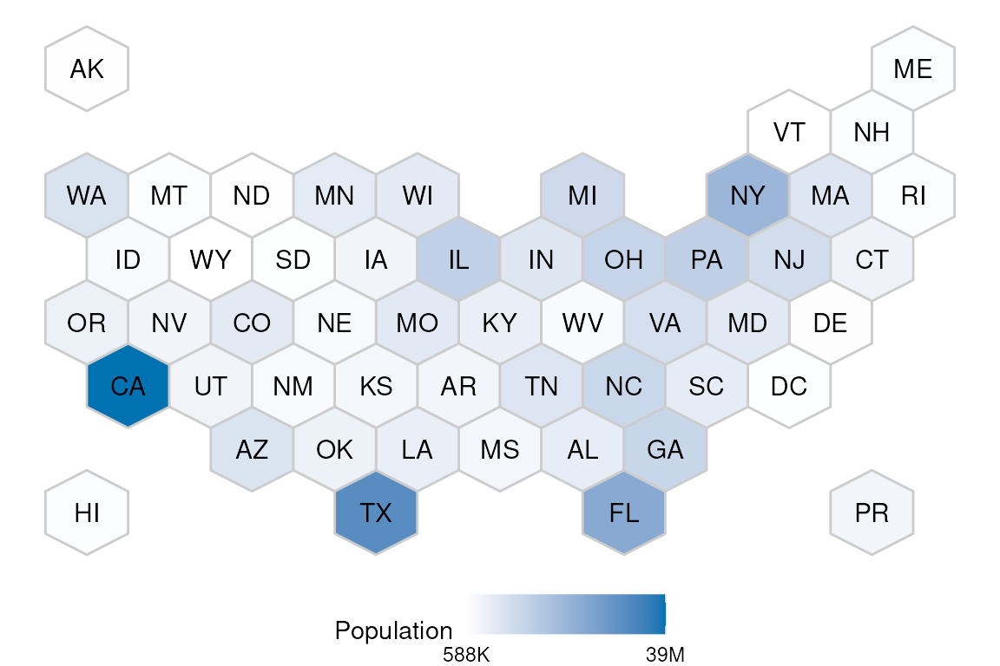

To display a different metric, pass the `variable` argument. This
example shows how to plot the number of counties from each state that
are undeserved:

``` r
atc_plot_us_map("below")
```

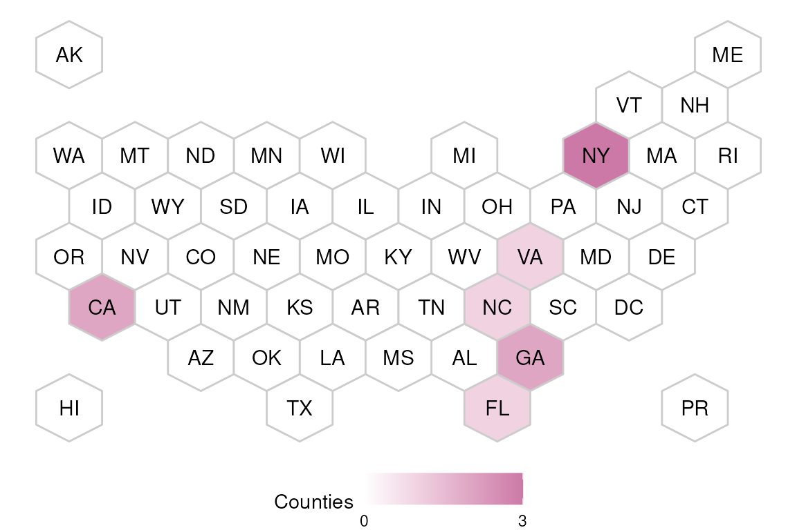

The colors for the `hospitals` and `population` variables can be
customized:

``` r
atc_plot_us_map("hospitals",
  colors = list(high = "orange", low = "blue")
)
```

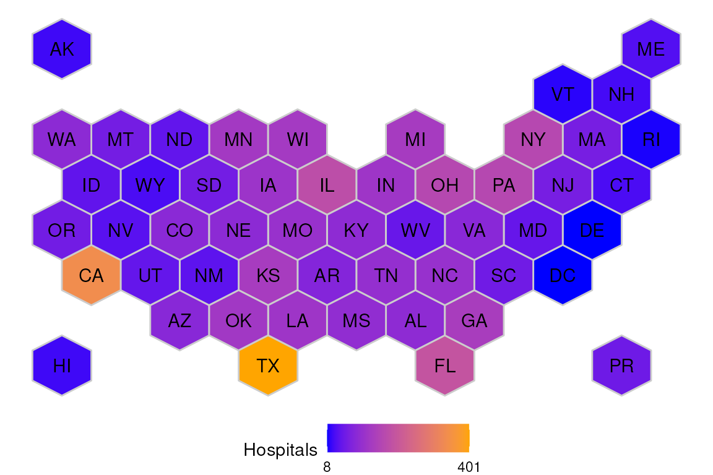

### Interactive

To try out the interactive version of the map, use
[`ggiraph::girafe()`](https://davidgohel.github.io/ggiraph/reference/girafe.html).
And pass the map’s output as the `ggobj` argument of that function:

``` r
ggiraph::girafe(ggobj = atc_plot_us_map())
```

## County level plot

### Usage and options

The output of
[`atc_plot_state_map()`](https://sol-eng.github.io/accesstocare/reference/atc_plot_state_map.md)
defaults to displaying the shape of every individual county. The plot
will display if the county has the appropriate number of hospitals, or
if it has more, or if it has less than expected, based on linear model
boundaries.

``` r
atc_plot_state_map()
```

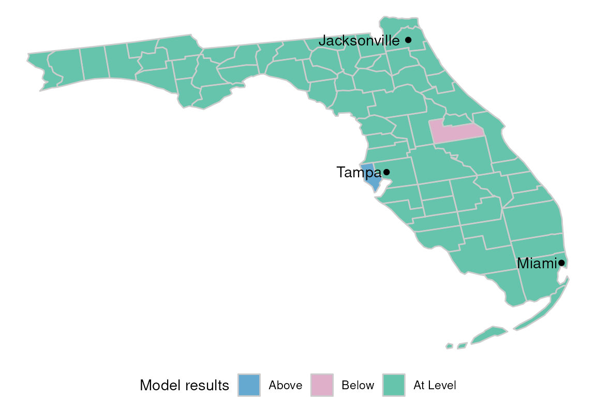

To view a given state’s results, pass the name as the `state` argument
of the function:

``` r
atc_plot_state_map("New York")
```

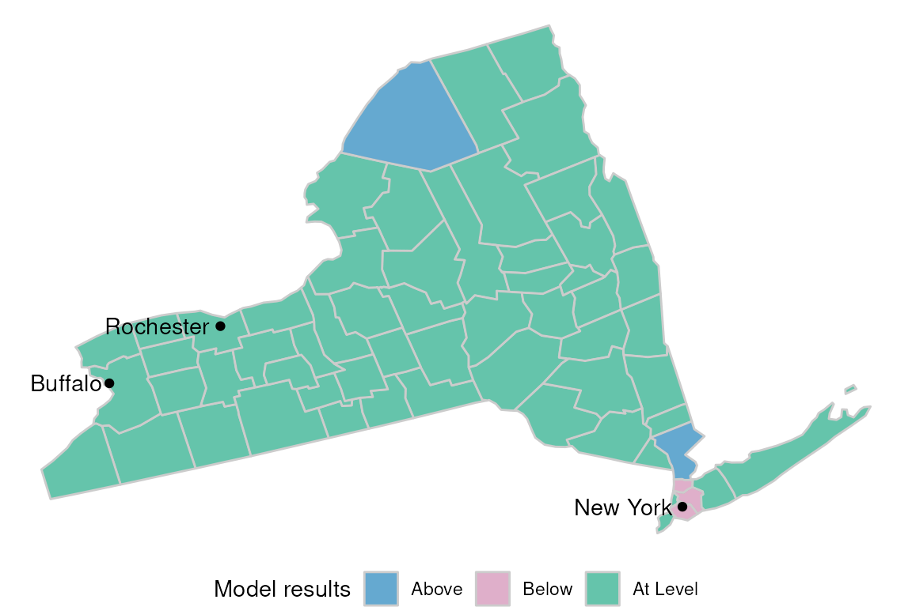

The status colors can be customized by passing the `model_color`
argument:

``` r
atc_plot_state_map("New York",
  model_colors = list(above = "blue", below = "orange", ok = "white")
)
```

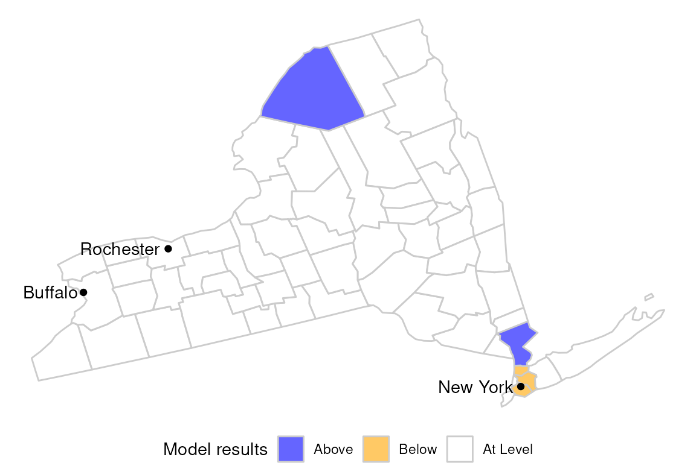

The `hospitals`, and `population` variables are also available for
plotting. Pass the `variable` argument to see:

``` r
atc_plot_state_map("New York",
  variable = "population"
)
```

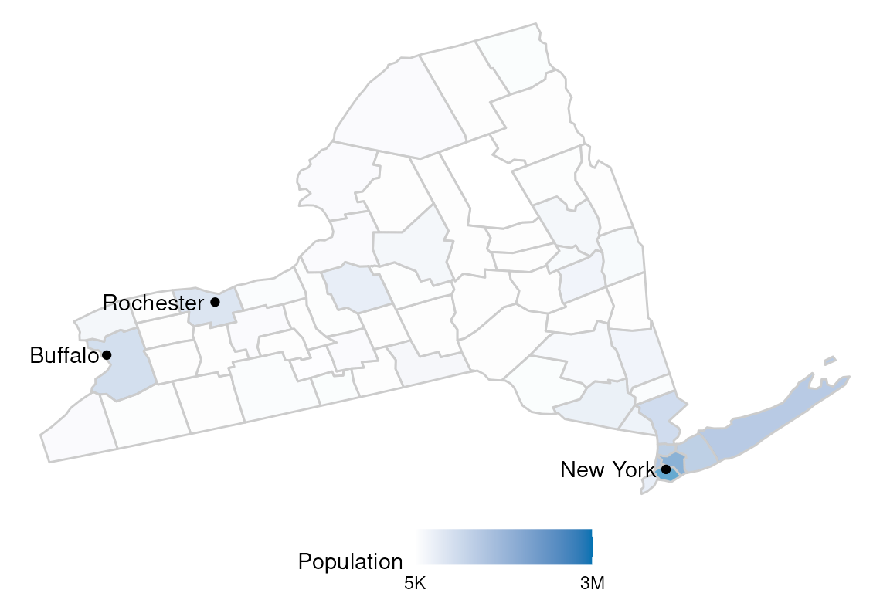

The colors of the continuous variables can also be customized using the
`color` argument:

``` r
atc_plot_state_map("New York",
  variable = "population",
  colors = list(low = "orange", high = "blue")
)
```

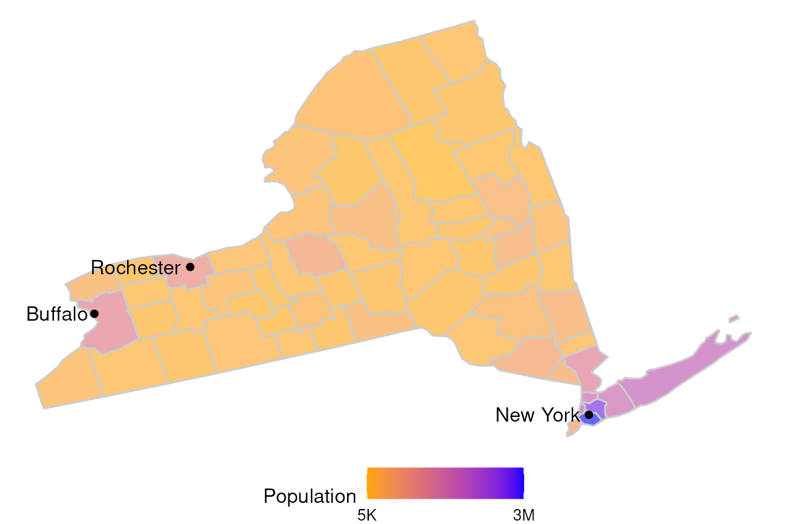

The display of more or less of the most populated cities can be
controlled using the `top_cities` argument.

``` r
atc_plot_state_map("New York", top_cities = 6)
```

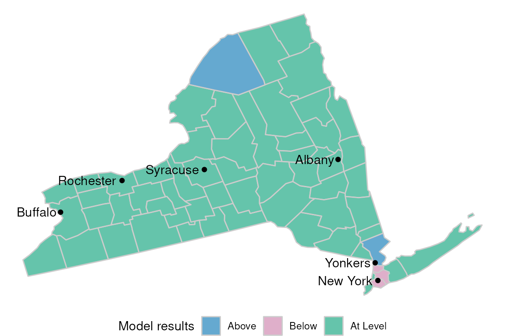

To get a map of every county in the US, pass `All US` to the `state`
argument:

``` r
atc_plot_state_map("All US", top_cities = 0)
```

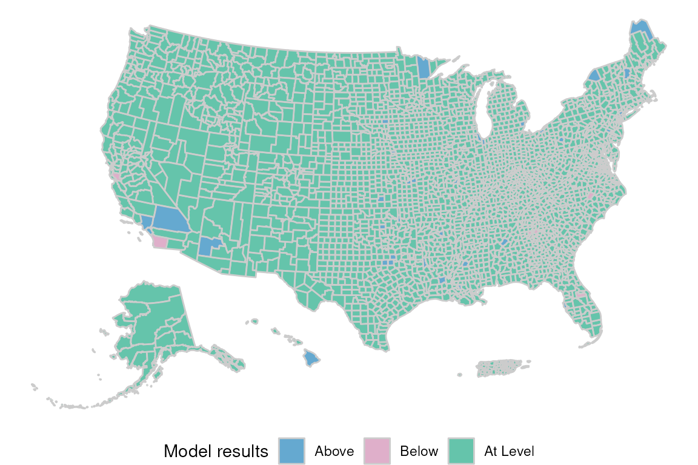

### Interactive

To try out the interactive version of the map, use
[`ggiraph::girafe()`](https://davidgohel.github.io/ggiraph/reference/girafe.html).
And pass the map’s output as the `ggobj` argument of that function:

``` r
ggiraph::girafe(ggobj = atc_plot_state_map())
```

## Hospital vs Population plot

### Usage and options

The
[`atc_plot_hospitals()`](https://sol-eng.github.io/accesstocare/reference/atc_plot_hospitals.md)
function displays a scatter plot comparing Hospitals to Population for
all the counties in the US.

``` r
atc_plot_hospitals()
```

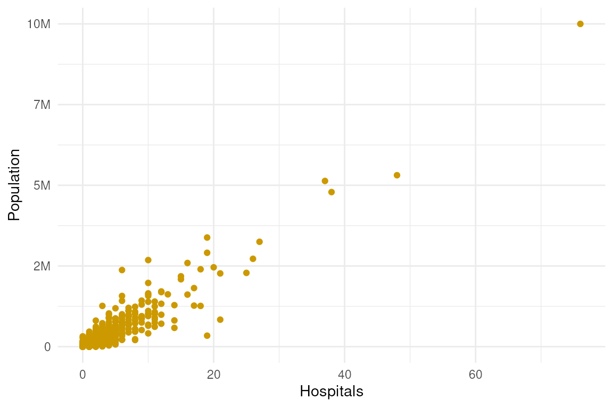

Overlay the upper and lower bound of the linear model using
`show_model_results`:

``` r
atc_plot_hospitals(show_model_results = TRUE)
```

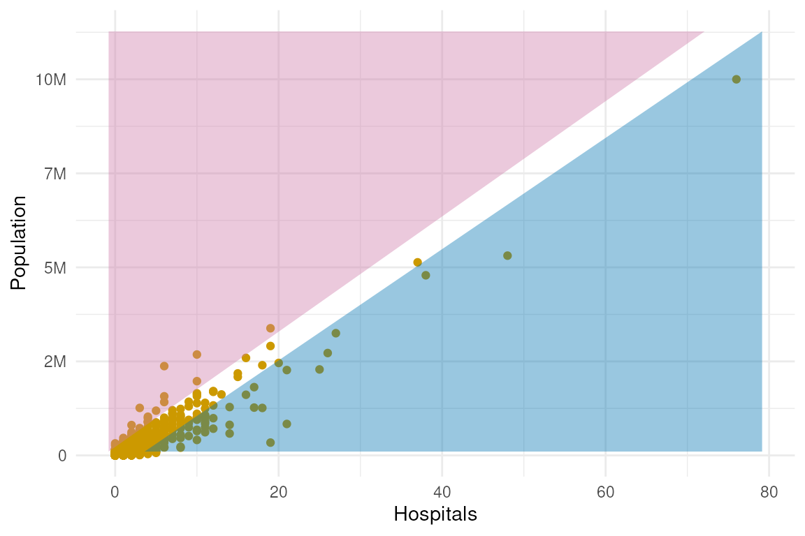

The bound colors can be customized by modifying the `model_colors`
argument:

``` r
atc_plot_hospitals(
  show_model_results = TRUE,
  model_colors = list(above = "green", below = "orange")
)
```

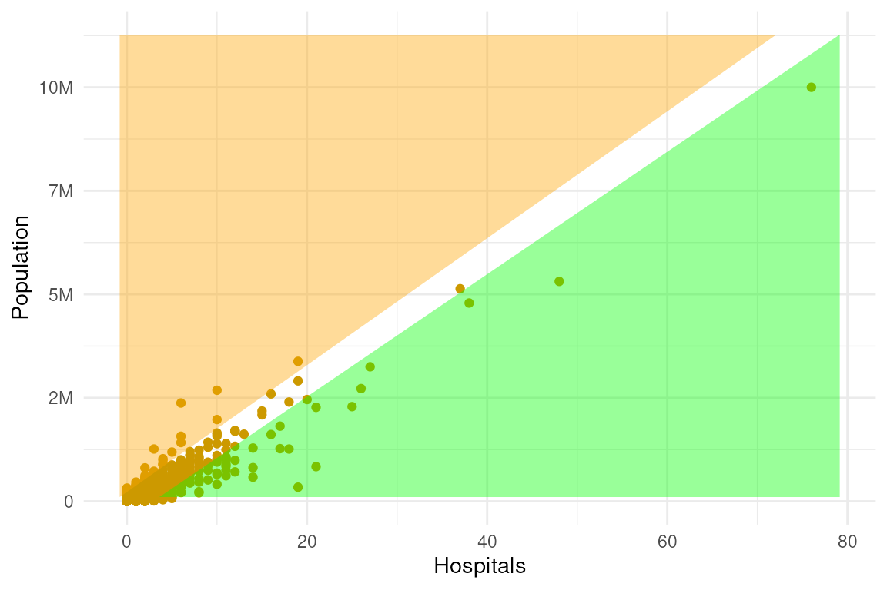

### Interactive

To try out the interactive version of the map, use
[`ggiraph::girafe()`](https://davidgohel.github.io/ggiraph/reference/girafe.html).
And pass the map’s output as the `ggobj` argument of that function:

``` r
ggiraph::girafe(ggobj = atc_plot_hospitals())
```
